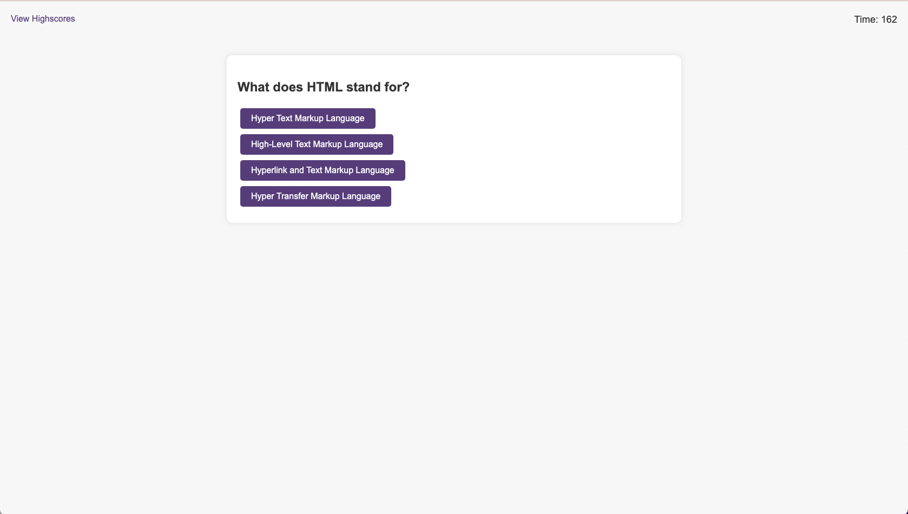

# Coding Quiz Challenge

This is a simple web application for a coding quiz challenge. Users can take a timed quiz on JavaScript fundamentals, and their scores can be stored for later comparison.


## Table of Contents

- [Introduction](#introduction)
- [Features](#features)
- [Technologies Used](#technology)
- [Getting Started](#getting-started)
- [Usage](#usage)
- [Screenshots](#screenshots)
- [Deployment](#deployment)
- [Contributing](#contributing)
- [About Me](#aboutme)
- [License](#license)

## Introduction

This is a simple web application for a coding quiz challenge. Users can take a timed quiz on JavaScript fundamentals, and their scores can be stored for later comparison.


## Features

- Timer that starts when the quiz begins.
- Questions presented one at a time.
- Feedback on correct and incorrect answers.
- Score penalty for incorrect answers.
- Ability to save initials and score.
- Highscores page to view and clear high scores.

## Technologies Used
- HTML
- CSS
- JavaScript

## Getting Started

To get started with Coding Quiz Challenge, follow these steps:

1. Clone this repository to your local machine.

```bash
  git clone https://github.com/EDXBootcamp/Quiz.git
```

2. Open the `index.html` file in a web browser.

## Usage

1. Open `index.html` in a web browser.
2. Click on the "Start Quiz" button.
3. To Add Questions or change questions edit "assets/js/questions.js"
4. To Increas Time on "logic.js" update 
```
 let timerSeconds = 180; 
```
4. To Increas Penalty for wrong answer on "logic.js" update 
```
 const penaltyTime = 10
```

## Screenshots



## Deployment

The application is deployed and accessible online. Visit the live version [here](https://edxbootcamp.github.io/Quiz/).

## Contributing

If you would like to contribute to this project, please follow these steps:

1. Fork the repository.
2. Create a new branch for your feature or improvement.
3. Make changes and submit a pull request.

## 🚀 About Me

I'm a full stack developer...

## 🔗 My Links

[](https://github.com/tjthouhid//)
[](https://www.linkedin.com/in/tjthouhid)
[](https://twitter.com/tjthouhid)

## License

This project is licensed under the [MIT License](LICENSE).
